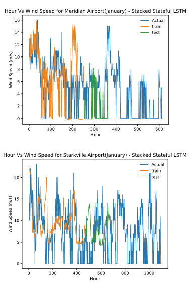
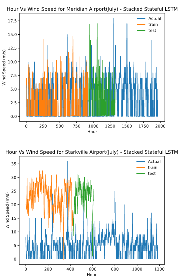

# HybridMLModelsforForecasting
Contains Python codes for Hybrid machine learning models viz. Stacked Stateless and Stateful LSTM, GRU, and Autoencoder LSTM RNN models

# Abstract
Wind speed is a powerful source of renewable energy, which can be used as an alternative to the non-renewable resources for production of electricity. Renewable sources are clean, infinite and do not impact the environment negatively during production of electrical energy. However, while eliciting electrical energy from renewable resources viz. solar irradiance, wind speed, hydro should require  special planning failing which may result in huge loss of labour and money for setting up the system. In this paper, we discuss four deep recurrent neural networks viz. Stacked Stateless LSTM, Stacked Stateless GRU, Stacked Stateful LSTM and Statcked Stateful GRU which will be used to predict wind speed on a short-term basis for the airport sites beside two campuses of Mississippi State University. The paper does a comprehensive analysis of the performance of the models used describing their architectures and how efficiently they elicit the results with the help of RMSE values. A detailed description of the time and space complexities of the above models has also been discussed.

III.	METHODOLOGY
We will use publicly available hourly time-series wind speed data from the SURFRAD database to extract meteorological features of specific locations across the two MSU campuses. We then plan to use correlation analysis to identify the features in the dataset that are most important to predicting wind speed output. Once we have identified our training features, we will compare four different stacked deep learning models: Stacked Stateful and Stacked Stateless Long Short-Term Memory (LTSM), and Stacked Stateful and Stacked Stateless Gated Recurrent Unit network (GRU). We will perform short-term wind speed forecasting by training our models on three months of data and predicting one to two days of the above locations. We will evaluate the models’ accuracies by calculating root mean squared error (RMSE), mean squared error (MSE) and F1 scores. Finally, we will do a comparative performance-based analysis to estimate which model is best suited for prediction of wind speed among the rest considered models. The parameters used are Hourly Dewpoint Temperature, Hourly Dry Bulb Temperature, Hourly Relative Humidity, Hourly Sea Level Pressure, Hourly Station Pressure, Hourly visibility, Hourly Wet Bulb Temperature, Hourly Wind Direction, and Hourly Wind Speed.

Data Set Extraction: The dataset is extracted from the National centers for Environmental Information National Oceanic and Atmospheric Administration (NOAA) (https://www.ncdc.noaa.gov/) which is publicly available.
Data Optimization: Raw data consists of iterative parameters were ignored for our experiment. We considered forecasted parameters viz. Hourly Dewpoint Temperature, Hourly Dry Bulb Temperature, Hourly Relative Humidity, Hourly Sea Level Pressure, Hourly Station Pressure, Hourly visibility, Hourly Wet Bulb Temperature, Hourly Wind Direction, and  Hourly Wind Speed to get accurate predictions.
Neural Networks: The optimized data is trained with neural networks. The selected recurrent neural networks are: stacked stateless LSTM (SSLL- STM), stacked stateful LSTM (SSFLSTM), stacked stateless GRU (SSLGRU), stacked stateful GRU (SSFGRU).
Result analysis: The results from the four neural network architectures are collected and then compared. This is done to show which model performs better for forecasting solar irradiance.

# Sample Outputs

  
 

 

  
 

  

# Time Complexity
The considered models use the following time complexities for its’ execution:
Stacked Stateful LSTM (SSFLSTM) – O(Tdhlogdh+Tdhdi) 
Stacked Stateless LSTM (SSLLSTM) - O(Tdhlogdh+Tdhdi) 
Stacked Stateful GRU (SSFGRU) – O(Td2h+Tdhdi) 
Stacked Stateless GRU (SSLGRU) - O(Td2h+Tdhdi)

# REFERENCES

[1]	Electricity Generation: https://en.wikipedia.org/wiki/Electricity_generation
[2]	What is Renewable Energy: https://www.un.org/en/climatechange/what-is-renewable-energy
[3]	Electricity Explained: https://www.eia.gov/energyexplained/electricity/electricity-in-the-us-generation-capacity-and-sales.php
[4]	The Causes of Climate Change: https://climate.nasa.gov/causes/
[5]	Recurrent neural network: https://en.wikipedia.org//wiki/Recurrent_neural_network
[6]	Senthil K. (2019). Improved Prediction of Wind Speed using Machine Learning, EAI Endorsed Transactions on Energy Web 6(23):157033.
[7]	Esma M., Ahmed H., Amar J., and Jasmin K. (2018). Wind Direction and Speed Prediction using Machine Learning. The International Symposium on Computer Science.
[8]	R. Pascanu, T. Mikolov, and Y. Bengio, “On the difficulty of training recurrent neural networks,” in International conference on machine learning, 2013, pp. 1310–1318.
[9]	S. Hochreiter and J. Schmidhuber, “Long Short-Term Memory,” Neural Comput., vol. 9, no. 8, pp. 1735–1780, Nov. 1997, doi: 10.1162/neco.1997.9.8.1735.
[10]	K. Cho et al., “Learning phrase representations using RNN encoder-decoder for statistical machine translation,” arXiv Prepr. arXiv1406.1078, 2014.
[11]	V. A. Bharadi and S. S. Alegavi, “Analysis of Long Short Term Memory (LSTM) Networks in the Stateful and Stateless Mode for COVID-19 Impact Prediction,” in Advanced Soft Computing Techniques in Data Science, IoT and Cloud Computing, S. Dash, S. K. Pani, A. Abraham, and Y. Liang, Eds. Cham: Springer International Publishing, 2021, pp. 167–190.
[12]	S. M. Kasongo and Y. Sun, “A Deep Gated Recurrent Unit based model for wireless intrusion detection system,” ICT Express, vol. 7, no. 1, pp. 81–87, 2021, doi: 10.1016/j.icte.2020.03.002.
[13]	A. Kisvari, Z. Lin, and X. Liu, “Wind power forecasting – A data-driven method along with gated recurrent neural network,” Renew. Energy, vol. 163, pp. 1895–1909, 2021, doi: 10.1016/j.renene.2020.10.119.
[14]	M. Zhang, H. Li, and X. Deng, “Inferential Statistics and Machine Learning Models for Short-Term Wind Power Forecasting,” Energy Eng. J. Assoc. Energy Eng., vol. 119, no. 1, pp. 237–252, 2022, doi: 10.32604/EE.2022.017916.
[15]	Saha, S., Majumder, N., Sangani, D., Das Bhattacharjee, A. (2022). Comprehensive Forecasting-Based Analysis Using Hybrid and Stacked Stateful/Stateless Models. In: Rout, R.R., Ghosh, S.K., Jana, P.K., Tripathy, A.K., Sahoo, J.P., Li, KC. (eds) Advances in Distributed Computing and Machine Learning. Lecture Notes in Networks and Systems, vol 427. Springer, Singapore. https://doi.org/10.1007/978-981-19-1018-0_49
[16]	Kumar, V. B., Nookesh, V. M., Saketh, B. S., Syama, S., & Ramprabhakar, J. (2021, October). Wind Speed Prediction Using Deep Learning-LSTM and GRU. In 2021 2nd International Conference on Smart Electronics and Communication (ICOSEC) (pp. 602-607). IEEE.

